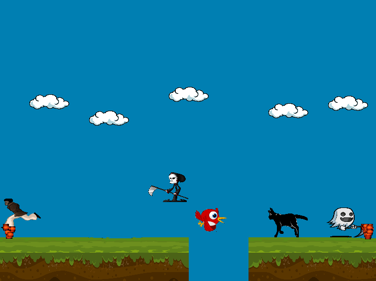

# PAC-MAN-2D

  

### A 2D Game-Engine Framework that does all the uplifting from low level stuffs like graphics programming and linear algebra to focus more on building the game

## Guide

##### 1. Build with Visual studio 2019.

##### 2. Incase you experience a link error anytime you build, try a clean Rebuild provided by MSVS 19.

##### 3. Application is located in bin/Pac-man/Debug/Win32/Pac-man.exe, Only Runs on Windows. (Tested on Windows 10).
